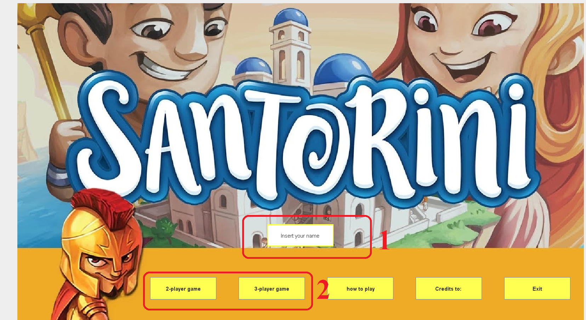
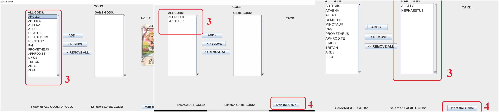
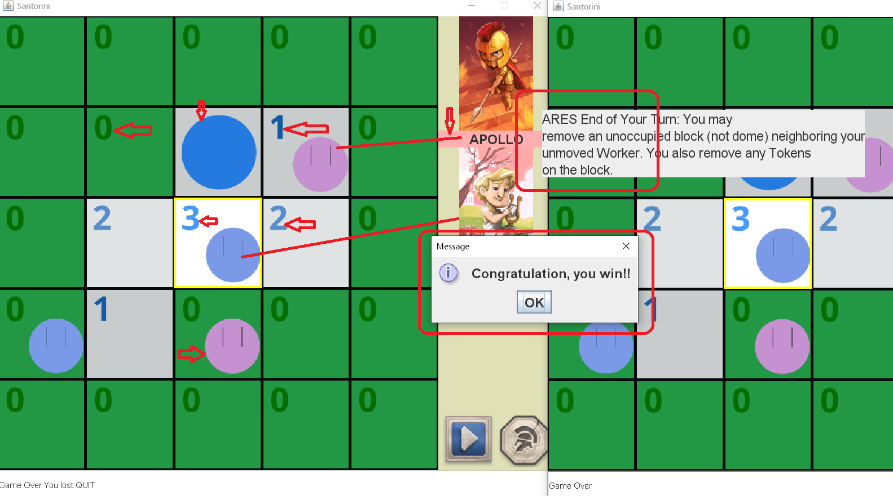

# Software Engineering Final Project
     Academic Year 2019-2020
-------------------------
*********
## The implementation of the board game called Santorini.
The following requirements have met:
* ***Complete Rules***
* ***CLI***
* ***GUI***
* ***Socket***
* ***2 Advanced Features:***
    - **Multiple match**
    - **Advanced Gods:**
        1. *Aphrodite*
        2. *Ares*
        3. *Limus*
        4. *Triton*
        5. *Zeus*

-------------------------
## HOW TO RUN THE PROGRAMM:

Game is loaded to the server Azure and released in single .jar file. While .jar file is clicked GUI is launched which connects the server Azure. In a negative case, the next arguments could be put:
The server can be set up that tries to operate in Server localhost  CLI or GUI  mode to make both work.
Without specifying an IP-address. It works with the IP of Azure. If it fails, IP should be specified from the server type of localhost.

-------------------------
## How to play the game: GUI tutorial

>1. Enter your name
>2. Choose the number of players
>3. Choose the God/Gods
>4. click the `start the Game` button

Once the one types his/her name and chooses the number of players, if there are enough players for a chosen game, depending who is the first accessed to the server gets to the God selection  stage.

 For the first player appears list of all Gods (14 Gods) and depending on the number of players in the about to start match chooses appropriate number of Gods and for the other players displaying God list contains only the ones that are selected by the first player.   
  
In the following image the board match with 2 players is represented:
 

Red arrows point 
1. to numbers from 0 to 3 and blue circle without the number with the meanings:
    - **O - board**
    - **1 - Level 1 TypeBlock**
    - **2 - Level 2 TypeBlock**
    - **3 - Level 3 TypeBlock**
    - **blue circle - DOME TypeBlock**
2. to the blue and pink circles with 2 vertical short lines linked to the Gods on the right side:
    - each color represents the God and God card has the same color
3. to the God power's explanation:
    - while mouse is on the God Card the power description appears
4. to the Dialog window:
    - appears when a player wins  

***************************************
## Some other tips to play:

**Pay attention to the message area, the one on the downside of the window** 

**After each step button with triangle should be clicked** 

**Before using the power make sure that it's active**

 
